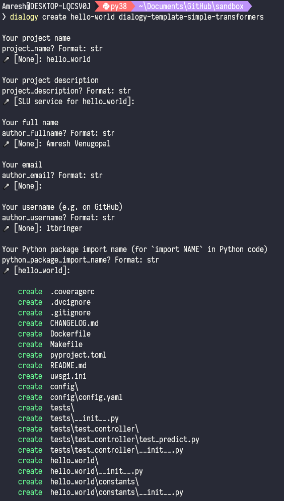

# \[[python_package_import_name]]

Made with Dialogy Template with Simple Transformers

## Features

1.  XLMRWorkflow uses "xlm-roberta-base" for both classification and ner tasks.
2.  Flask integration.
3.  Sentry integration.

## Directory Structure

| File                                      | Description                                                                  |
| ----------------------------------------- | ---------------------------------------------------------------------------- |
| **config**                                | A directory that contains `yaml` files.                                      |
| **data**                                  | Version controlled by `dvc`.                                                 |
| **data/0.0.0**                            | A directory that would contain these directories: datasets, metrics, models. |
| **\[[python_package_import_name]]/dev**   | Programs not required in production.                                         |
| **\[[python_package_import_name]]/src**   | Programs required in production.                                             |
| **\[[python_package_import_name]]/utils** | Programs that offer assitance in either dev or src belong here.              |
| **CHANGELOG.md**                          | Track changes in the code, datasets, etc.                                    |
| **Dockerfile**                            | Containerize the application for production use.                             |
| **LICENSE**                               | Depending on your usage choose the correct copy, don't keep the default!     |
| **Makefile**                              | Helps maintain hygiene before deploying code.                                |
| **pyproject.toml**                        | Track dependencies here. Also, this means you would be using poetry.         |
| **README.md**                             | This must ring a bell.                                                       |
| **uwsgi.ini**                             | Modify as per use.                                                           |

## Getting started

Make sure you have `git`, `python==^3.8`, [`poetry`](https://python-poetry.org/docs/#installation) installed. Preferably within a virtual environment.

### 1. Boilerplate

To create a project using this template, run:

```shell
pip install dialogy
dialogy create hello-world dialogy-template-simple-transformers
```

The above initiates an interactive session.


The questions here help: 

-   Populate your [`pyproject.toml`](https://python-poetry.org/docs/pyproject/) since we use [`poetry`](https://python-poetry.org/docs/) for managing dependencies and other nifty tools.
-   Create a repository and python package with the scaffolding you need.

### 2. Install Dependencies

```shell
cd [[python_package_import_name]]
poetry install
```

### 3. Version control

We use [`dvc`](https://dvc.org/doc/install) for dataset and model versioning. 
s3 is the preferred remote to save project level data that are not fit for tracking via git.

The `poetry install` step takes care of dvc installation.

```shell
git init
dvc init
dvc remote add -d s3remote s3://bucket-name/path/to/dir
poetry run dialogy data --version=0.0.0
dvc add data
```

This will create a data directory with the following structure:

```shell
data
+---0.0.0
    +---classification
    |   +---datasets
    |   +---metrics
    |   +---models
    +---ner
        +---datasets
        +---metrics
        +---models
```

It is evident that this template concerns itself with only `classification` and `ner` tasks.

You'd typically move your datasets into the datasets directory. The dataset should be split beforehand into `train.csv` and `test.csv`. This template expects these files to be named this way.

The format for classification task `train.csv` is:

```python
In [1]: df[["data", "labels"]].sample(40)
Out[1]:
                                                    data                  labels
7359   {"alternatives": [[{"transcript": "मुझे अपना ड..."                  status
19337  {"alternatives": [[{"am_score": -182.39217, "c..."            stop_payment
903    {"alternatives": [[{"transcript": "का", "confi..."               _confirm_
15473  {"alternatives": [[{"transcript": "मैं लोन का ..."                query_loan
18133  {"alternatives": [[{"transcript": "मुझे अपने अ..."        request_statement
18954  {"alternatives": [[{"am_score": -718.3479, "co..."       request_statement
2047   {"alternatives": [[{"am_score": -440.15454, "c..."          account_status
16159  {"alternatives": [[{"transcript": "कस्टमर केयर..."            request_agent
13193  {"alternatives": [[{"am_score": -702.66943, "c..."                   limit
4359   {"alternatives": [[{"am_score": -556.99493, "c..."  branch_address_readout
9561   {"alternatives": [[{"am_score": -479.57098, "c..."       ifsc_code_readout
4084   {"alternatives": [[{"am_score": -304.17725, "c..."  branch_address_readout
15437  {"alternatives": [[{"transcript": "मेरा लोन का..."               query_loan
19543  {"alternatives": [[{"am_score": -182.39217, "c..."            stop_payment
```

And an example for the ner task dataset is:

```python
In [2]: df[df["labels"] != "O"].sample(10)
Out[2]:
        sentence_id   words          labels
79854         14114       a               O
47782         10007  credit  B-product_kind
37038          7785   still               O
16142          5511    card  I-product_kind
13709          5205    want               O
114028        18547    just               O
61436         12006  offers    B-properties
106472        17546      my               O
91673         15458       i               O
85928         14710   other               O
```

Either dataset may contain any number of arbitrary columns but:

-   The columns named `data` and `labels` are necessary for the classification datasets.
-   Likewise, `sentence_id`, `words`, `labels` are necessary for NER datasets.

A single instance in the `data` column for classification tasks should look like:

```json
{
    "alternatives": [[
        {"transcript": "चेक बुक कब मिलेगा",
            "confidence": 0.9581535,
            "am_score": -364.68695,
            "lm_score": 121.946655},
        {"transcript": "चेकबुक कब मिलेगा",
            "confidence": 0.958522,
            "am_score": -362.57028,
            "lm_score": 123.00037}]],
    "context": "...""
}
```

### 4. Training

Before training, your directory tree should look like:

```shell
data
+---0.0.0
    +---classification
    |   +---datasets
    |   |   +---train.csv
    |   |   +---test.csv
    |   +---metrics
    |   +---models
    +---ner
        +---datasets
        |   +---train.csv
        |   +---test.csv
        +---metrics
        +---models
```

These commands help in training the classifier and the NER model.
Specifying the model name in the command will train only the mentioned model.

```shell
poetry run dialogy train [--version=<version>]
poetry run dialogy train classifier [--version=<version>] # trains only classifier.
poetry run dialogy train ner [--version=<version>] # trains only NER.
```

Once the training is complete, you would notice the models would be populated:

```shell
data
+---0.0.0
    +---classification
    |   +---datasets
    |   |   +---train.csv
    |   |   +---test.csv
    |   +---metrics
    |   +---models
    |       +---config.json
    |       +---eval_results.txt
    |       +---labelencoder.pkl
    |       +---model_args.json
    |       +---pytorch_model.bin
    |       +---sentencepiece.bpe.model
    |       +---special_tokens_map.json
    |       +---tokenizer_config.json
    |       +---training_args.bin
    |       +---training_progress_scores.csv
    +---ner
        +---datasets
        |   +---train.csv
        |   +---test.csv
        +---metrics
        +---models
            +---config.json
            +---entity_label_list.pkl
            +---eval_results.txt
            +---model_args.json
            +---pytorch_model.bin
            +---sentencepiece.bpe.model
            +---special_tokens_map.json
            +---tokenizer_config.json
            +---training_args.bin
```

### 5. Evaluation

To evaluate the models just replace the above commands with test!

```shell
poetry run dialogy test [--version=<version>]
poetry run dialogy test classifier [--version=<version>]
poetry run dialogy test ner [--version=<version>]
```

(If the version argument is not provided, a default value is used from the _config/config.yaml_.)

Evaluation scripts save the reports in the `metrics` directory.

```shell
data
+---0.0.0
    +---classification
    |   >---datasets # collapsed
    |   +---metrics
    |   |   +---report.csv
    |   >---models # collapsed
    +---ner
        +---datasets
        |   +---train.csv
        |   +---test.csv
        +---metrics
        |   +---report.csv
        >---models # collapsed
```

You may see it only in one directory depending on the test command arguments provided.

### 6. Interactive Session

To run your models to see how they perform on live inputs, use the following command:

```shell
poetry run dialogy repl
```

This prints a set of expected input formats, **if nothing matches, it assumes the input to be plain-text!**
**Make sure you press ESC then ENTER to submit**.

This interface accepts multiline input and takes most people off-guard as they lie waiting for a response.

The reason for putting in a multiline input is to offer convenience over pasting large json request bodies encountered in production and need to be tested locally for debugging.

### 7. Releases

The project comes with an opinion on data management. The default branch (main/master) is expected to contain only the latest version of datasets and models.
The process creates a git tag with the semver so that you can checkout the tag for working on it in isolation to the rest of the project.

To initiate a release process, perform:

```shell
poetry run dialogy release --version=<version>
```

### 8. Serving

This template also installs [`Flask`](https://flask.palletsprojects.com/en/1.1.x/) for serving APIs. Use its standard documentation for setting up APIs and serving applications.

**Do note, the default Flask server is not meant for production!**. Use [`uwsgi`](https://www.digitalocean.com/community/tutorials/how-to-serve-flask-applications-with-uswgi-and-nginx-on-ubuntu-18-04) instead.

## Commands

These are the available cli commands:

1.  poetry run dialogy train [--version=&lt;version&gt;]

    Routine for training both Classifier and NER sequntially.
    Provide a version and a model will be trained on a dataset of the same version.

    This script expects data/&lt;version> to be a directory where models, metrics
    and dataset are present.

2.  poetry run dialogy test [--version=&lt;version&gt;]

    Routine for testing both Classifier and NER sequentially.
    Provide a version to evaluate a trained model on an evaluation dataset.

3.  poetry run dialogy (train|test) (classification|ner) &lt;version>

    Same as the previous train and test commands with an exception of only one type of
    task (classification|ner) is picked.

4.  poetry run dialogy data [--version=&lt;version&gt;]

    This command creates a directory named &lt;version> under data.
    Helpful if only empty directory structures are needed.

5.  poetry run dialogy clone &lt;from_version> &lt;to_version>

    This command copies a directory from another under data.
    Helpful if only directory structures and their data should be copied.

6.  poetry run dialogy repl [--version=&lt;version&gt;]

    This command starts up an interactive terminal to dump json or plain text
    and interact with the trained models.

7.  poetry run dialogy release &lt;version>

    This command syncs dvc and git data, produces a tag on the repo and manages remote state.

```shell
Usage:
  __init__.py (train|test|repl) [--version=<version>]
  __init__.py (train|test) (classification|ner) [--version=<version>]
  __init__.py data --version=<version> [--force]
  __init__.py clone <from_version> <to_version> [--force]
  __init__.py release --version=<version>
  __init__.py (-h | --help)

Options:
    <from_version>          The source data directory; models, datasets, metrics will be copied from here.
    <to_version>            The destination data directory; models, datasets, metrics will be copied here.
    --version=<version>     The version of the dataset, model, metrics to use.
    --force                 Pass this flag to overwrite existing directories.
    -h --help               Show this screen.
```

## Config

```yaml
project_name: [[python_package_import_name]]
version: 0.0.0 # Default version
cores: 8 # no of cpu cores to use for pre-processing.
tasks:
  classification:
    use: true # Use classifier model only if this is True.
    threshold: 0.1 # confidence threshold.
    labels: [] # Expected labels, auto-populates the first time a dataset is given.
    alias: # Label aliases
        label_alias_1: an_original_label
        label_alias_2: an_original_label
        label_alias_3: another_original_label
        label_alias_4: yet_another_original_label
    model_args:
      train: {} # These are model arguments for
      prod: {}  # simpletansformers models
      test: {}  # refer to description.
  ner:
    use: false # prediction will not invoke ner predictions.
    threshold: 0.6 # confidence threshold.
    labels: [] # Expected labels, auto-populates the first time a dataset is given.
    model_args:
      train: {} # These are model arguments for
      prod: {}  # simpletansformers models
      test: {}  # refer to description.
rules:
  slots: # Relationship shows intents that can contain certain entities.
    intent_a: # contains entity_x and entity_y within slots a-slot-name
        entity_x: # and other-slot-name respectively.
            slot_name: "a-slot-name"
            entity_type: "x-type"
        entity_y:
            slot_name: "other-slot-name"
            entity_type: "y-type"
    intent_b: # contains only entity_y within another-slot-name.
        entity_y:
            slot_name: "another-slot-name"
            entity_type: "y-type"
# Other intents don't contain entities so their slots will be empty.
```

Model args help maintain the configuration of models in a single place, [here](https://simpletransformers.ai/docs/usage/#configuring-a-simple-transformers-model) is a full list, for classification or NER model configuration.

## APIs

These are the APIs which are being used. Some of these are not needed in production.

1.  Health check - To check if the service is running.

    ```python
    @app.route("/", methods=["GET"])
    def health_check():
        return jsonify(
            status="ok",
            response={"message": "Server is up."},
        )
    ```

2.  Predict - This is the main production API.

    ```python
    @app.route("/predict/<lang>/<project_name>/", methods=["POST"])
    ```

## Customization

The best place to setup custom code is the `src` dir. The existing `workflow` would
usually be modified to have api level changes. The API itself can be modified via `api/endpoints.py`.

To modify configuration edit `config/config.yaml`.

## Upcoming Features

-   Stockholm
-   Data conflict
-   Data summarization
-   Visualization and interpretability
